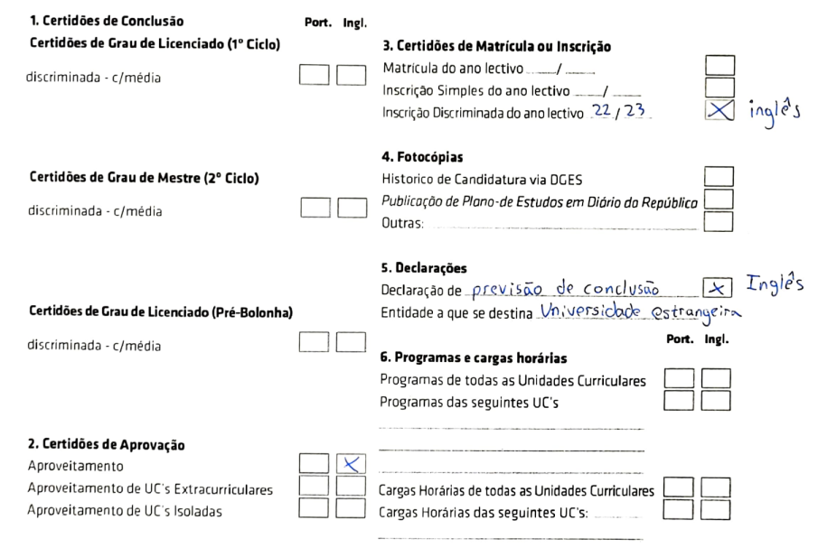

+++
title = "From IST to KTH: How I Ended Up Studying Abroad in Sweden"

[taxonomies]
tags = ["personal-life"]
+++

A little over a year ago, due to my own interests but also some
peer pressure from my friends and family, I started thinking about the possibility
of studying abroad, either for the whole masters, or only for one or two semesters.
This is the story of all the twists and turns in my journey to end up studying
in the [MSc Cybersecurity at KTH], in Sweden.
<!-- more -->

## How It Started

During the summer break, some of my friends started discussing studying abroad.
Initially, I was just reading the messages they were sending while they investigated the
various universities they were interested in applying to, but eventually I started doing
some research myself.
Interestingly enough, while KTH was mentioned at the time, I had not considered it
as one of my choices, which mostly consisted of universities in the Netherlands.

As weeks came and went, I got drowned in assignments and pushed aside submitting
any applications, mainly due to dreading the work involved with getting all the
legal paperwork necessary. Looking back, getting the required documents was not
that big of a headache all things considered (more on that later).

Around October, some of my friends started considering doing Erasmus instead.
It was a very appealing proposition: I would still get the experience of studying and
living abroad (and moving out of my parent's house), while enjoying a hassle free
application (it would be just a few clicks in my university's website).
Granted, it would not look as good on my CV as a full-blown masters abroad, but it
would still be relevant.
Furthermore, at the time I had considered doing it for two semesters and not just
one (as, as far as I was aware, it would be allowed).
For this reason, I was mostly interested in doing Erasmus starting in the first
semester of my masters, in order to avoid doing the thesis abroad.

Taking into the account the available destination universities from previous years,
I ended up picking [UvAmsterdam], [TU/Delft] and [TUMunich] as my top choices.
Again, at this point, despite being one of the options, KTH was still not on my radar,
mainly because of me never having heard of it.

## Where It All Fell Apart

With everything already planned and ready for the Erasmus applications on the 3rd of
January of 2023, there was nothing to do but wait (and enjoy the deserved Christmas break!).
After all, what could go wrong? _A lot, it turns out._

To have the necessary context of what happened here, we need to go back to 2021,
when a structural change of the programmes was introduced at my university,
Técnico Lisboa (IST), called MEPP.
Amongst other (overall disliked) changes, the 5 year bachelor + masters programmes
were broken apart into 3 and 2 year programmes, respectively.
Perhaps the most notable consequence was that students are no longer guaranteed
a spot on the masters, and instead have to apply if they want to continue their
studies after the bachelor.

_You might already see where this is going._

Even though we had enrolled in the bachelor in 2020, before these changes were
implemented, and therefore had a guaranteed spot on the masters due to the
transition, our eligibility to do Erasmus in the first semester was still dubious.
With this in mind, and knowing that the class one year older than us had had the
same problem the year prior, my friends and I decided to reach out to both the
Mobility Coordinator for our programme, as well as the Mobility and International
Cooperation Office (NMCI) at your school, well in advance (around October/November).
After exposing our exact situation, and highlighting the problems from the year prior,
both said we would be allowed to do what we were planning to.
While my friend contacted the Mobility Coordinator by email, another friend and I went
in person to NMCI to ask our questions, and ended up not having any record of
that conversation.

On the 3rd of January of 2023, all hell broke loose when the applications opened
and were accompanied by a note published the day prior by the school, saying that
having completed 30 ECTS of master-level courses would be required to apply.
Upon hearing the news, we were, understandably, feeling angry, upset, betrayed,
and a myriad of other emotions that no words could describe (I might be
exaggerating a bit, but we were pretty mad).
We were clearly not the only ones, since there was an Erasmus Q&A Zoom session
hosted by NMCI a few days later, where other students also demanded to know why
they were not being allowed to apply.

On that same day, one of my friends just decided he was going to apply to KTH,
as it was the closest deadline and there was no application fee (for EU students).
After considering all my previous research, I promptly followed suit, with plans
to apply to [TU/Eindhoven] and [TUMunich] if I did not get accepted, given their
application deadlines were after KTH's results publication.
Also, I excluded both [TU/Delft] and [UvAmsterdam] from my list of options
since the former required that I did the GRE (a General Test, that would require
further monetary investment and time) and the latter required a bachelor thesis,
which we do not have at IST.

## The Application Process: Speedrun Edition

With less than a month to go, two friends of mine and I started gathering all
the required documents.
While the application itself (i.e., picking which programmes we were applying to)
had to be done by the 15th of January, documents could still be submitted until
the 1st of February.

The first step was to book an English exam.
I opted for the [IELTS Academic] since one of my friends had already picked that
one, and, more importantly, I would get the results before the end of the month.
For that reason, I booked the test for the 22nd of January and got the results
on the 26th.
However, I was later made aware that taking the C2 Proficiency (CPE) exam at
[English Exam Centre] would have been cheaper, but I'm not sure if I could have
gotten the results on time.

The second challenge was to get all the required legal documents from our
university, since IST's Graduate Area (AG) is notorious for being slow.
Therefore, on the 6th of January, my friend and I went to their office in
person, and, after waiting 2 to 3h in the queue, we got information on
what documents we needed to request and their cost.

_[ Note: the information below is subject to changes, so take it with a grain of
salt ]_

There were four documents [University Admissions], the website used to apply to
any Swedish university, asked us, considering that we were still in the last
year of our bachelors:

- A transcript with all courses completed to date, including their respective
  grades (40€).
- A list of the courses we were already enrolled in (0€, since it was the first time).
- A declaration stating we were enrolled in the bachelors in that specific academic
  year (0€, available to all students in the Fénix Drive at the beginning of the year).
- A declaration stating that we were in the last year of the bachelors and would
  finish that same year if we completed all courses we were enrolled in (10€).

I'm unsure if the last document is required, but that's what the Graduate Area advised
us to send.

One thing to note is that, while the University Admission's website states that the documents
must be in Portuguese and then officially translated, we asked them and it turns
out **we can just submit the documents in English**, which IST provides, so we did.
Additionally, since the first semester had not finished yet, the grades in the transcript
were only up to the second semester of the second year.

For future reference, to get these documents, one needs to fill out [R01 - Requerimento Certidão]
as in the picture below, and send it to AG's email address:

To our surprise, we got the documents quite quickly, having submitted the
request on the 6th and received them on the 12th.
With the bureaucratic stuff out of the way, we now needed to focus on the
recommendation and motivation letters.

Now is where things will differ depending on the programme.
Both the MSc Cybersecurity and MSc Computer Science I applied to required two
recommendation letters, ideally one from a professional setting and another
from an educational one.
Since I worked at DSI (the Computer and Network Services at IST) at the time,
I asked my direct supervisor for a letter.
Picking a teacher to ask a recommendation letter was more complicated, but I
ended up asking the teacher of the Computer Network course, which I was still
attending at that date.
One thing to keep in mind while submitting these recommendation letters is that
they must have contact details of the referees', such as their email, phone number
and address (but you can probably get away with just the email).

Lastly, we needed to write our motivation letters and our CV. This was obviously
the most personal part of the application, and while it was a bit of work, it was
easy to do with the time we had left.
Additionally, KTH's student blog has some tips for writing motivation letters,
which guided us through it.

// TODO form; screenshots of submission; cluster

## Scholarships - A Failed Side Quest

In an effort to decrease the total costs of this adventure, I decided to apply
to two scholarships here in Portugal.

// TODO

## The Big Day

// TODO

## In Search for Accommodation

// TODO

## Remaining Documents

// TODO

## Bye, Portugal

// TODO

## Final Thoughts

// TODO

[MSc Cybersecurity at KTH]: https://www.kth.se/en/studies/master/cybersecurity
[UvAmsterdam]: https://www.uva.nl/en
[TU/Delft]: https://www.tudelft.nl/en/
[TUMunich]: https://www.tum.de/en/
[TU/Eindhoven]: https://www.tue.nl/en/
[IELTS Academic]: https://takeielts.britishcouncil.org/
[English Exam Centre]: https://www.englishexamcentre.pt
[University Admissions]: https://www.universityadmissions.se
[R01 - Requerimento Certidão]: http://graduacao.tecnico.ulisboa.pt/formularios/
